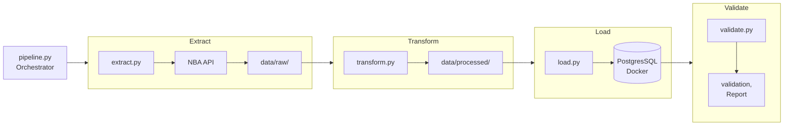

# NBA ETL Pipeline — 2024/25 Season

This is a data engineering project that extracts NBA player statistics from the NBA API, transforms and cleans the data, and loads it into a PostgreSQL database running in Docker. It was built as a demonstration of core data engineering skills including ETL pipeline development, dimensional modelling, and data validation. 

---

## Architecture Diagram




---

## Folder Structure
```
DDEP_NBA/
├── data/
│   ├── processed/            # Cleaned CSVs ready for loading
│   └── raw/                  # Original CSV extracted from NBA API
├── docs/                     # Supporting documentation
├── sql/
│   ├── sample_queries.sql    # Example analytics queries
│   └── schema.sql            # Table definitions, indexes
├── src/
│   ├── extract.py            # Pulls data from NBA API
│   ├── load.py               # Loads data into PostgreSQL
│   ├── pipeline.py           # Orchestrates full ETL process
│   ├── transform.py          # Cleans and reshapes data to match schema
│   └── validate.py           # Validates data loaded correctly
├── .env                      # Local credentials (not committed)
├── .gitignore                # Excludes sensitive files from version control
├── docker-compose.yml        # Defines and runs the PostgreSQL container
├── requirements.txt          # Python dependencies — install with pip install -r requirements.txt
└── README.md                 # Project documentation
```

---

## Prerequisites

- Python 3.x
- Docker Desktop

---

## Setup

### 1. Clone the repository
```bash
git clone 
cd DDEP_NBA
```

### 2. Create a virtual environment
```bash
python -m venv venv
venv\Scripts\activate
```

### 3. Install dependencies
```bash
pip install -r requirements.txt
```

### 4. Create a `.env` file in the project root
```
DB_HOST=localhost
DB_PORT=5432
DB_NAME=nba
DB_USER=postgres
DB_PASSWORD=yourpassword
```

Credentials are stored in a `.env` file excluded from version control via `.gitignore`. 

### 5. Start the PostgreSQL container
```bash
docker-compose up -d
```

Verify the container is running:
```bash
docker ps
```

You can also access Adminer, a database GUI, at `http://localhost:8080`.

### 6. Create the database tables
```bash
Get-Content sql/schema.sql | docker exec -i nba-postgres psql -U postgres -d nba
```

---

## Running the Pipeline

To run the full ETL pipeline:
```bash
python src/pipeline.py
```

This will:
1. Extract current NBA player stats from the NBA API
2. Transform and clean the data
3. Load it into PostgreSQL

To run individual steps:
```bash
python src/extract.py
python src/transform.py
python src/load.py
```

To validate the data:
```bash
python src/validate.py
```

---

## Schema Design

The database uses a **star schema** — an industry standard for analytical workloads consisting of a central fact table surrounded by dimension tables.

### `dim_player`
Stores player identity information. Deduplicated on `player_id`.

### `dim_team`
Stores team information. Deduplicated on `team_id`. 30 rows — one per NBA team.

### `fact_player_stats`
Stores player performance statistics for the 2024-25 season. Uses a surrogate key `stat_id` because players who were traded mid-season appear multiple times — once per team.

### Design Decisions
- Specified `utf-8-sig` encoding when saving the raw CSV to correctly handle player names which conatin accents, preventing data corruption flowing through the rest of the pipeline
- Dropped all `_RANK` columns as these can be derived from the data using SQL, avoiding redundant storage
- Dropped `WNBA_FANTASY_PTS` as irrelevant to this dataset
- Kept `NBA_FANTASY_PTS` as a useful performance metric
- Added indexes on `player_id` and `team_id` foreign keys in the fact table to optimise JOIN performance
- Stats normalised per game in queries rather than using totals, to fairly compare players with different games played

---

## Pipeline Design

Each script is modular and can be run independently or together via `pipeline.py`. The pipeline is **idempotent** — tables are truncated before each load, so it can be run multiple times without producing duplicate data or errors. This is important in production where pipelines may need to be rerun due to failures or data updates.

---

## Analytics

Sample queries are available in `sql/sample_queries.sql` covering:
- Young players excelling (under 25)
- Best offensive players by points and efficiency per game
- Best defensive players by steals and blocks
- Win percentage by team
- Win percentage vs fantasy points correlation
- Player points per game ranked by team

### Known Limitations
- Win percentage queries (4 and 5) derive team standings from player-level data.
    - Currently workign on bringing in more data for better analysis
- The dataset is a point in time snapshot from when the pipeline was last run. In time I will look to scheduling runs through apache airflows

---

## Validation

`validate.py` runs four checks after each load:
- **Row counts** — confirms PostgreSQL row counts match the processed CSVs
- **Duplicates** — checks for duplicate primary keys in all three tables
- **Null values** — checks critical columns contain no null values
- **Foreign key integrity** — confirms no orphaned records in the fact table

---

## Production Considerations

If this pipeline were to be productionised:
- Scheduling would be handled by Apache Airflow or a cron job
- Credentials would be managed through a secrets manager
- The PostgreSQL instance would be hosted on a cloud provider such as AWS RDS or Azure Database
- Additional logging and alerting would be added for pipeline failures
- The print staements used throughout the pipeline would be replaced by python's logging module to provide persistent records, timestamps and severity levels - essential for audit trails and monitoring
